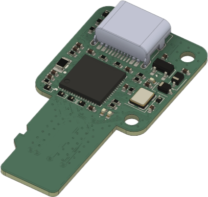
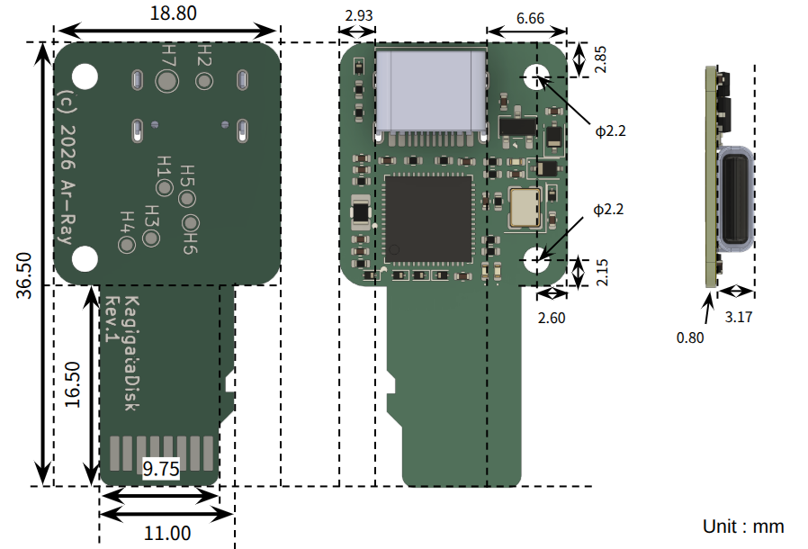
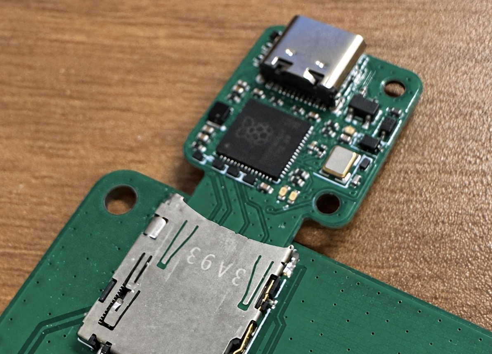
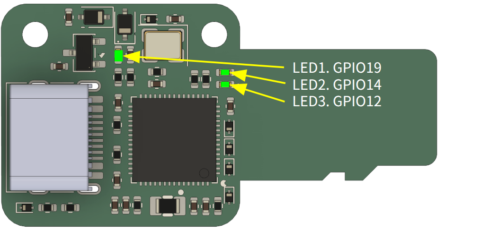
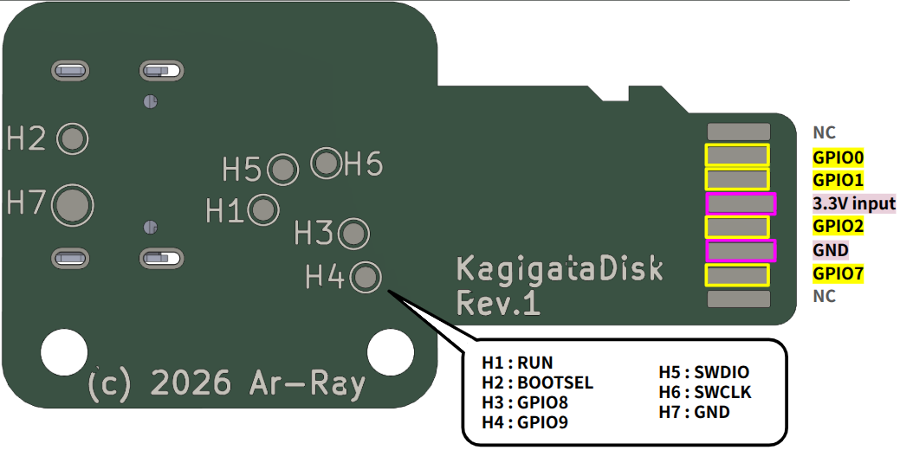

# KagigataDisk



## 特徴

### 1. 小型で特徴的なデザイン

USBとSPIインタフェースの2点に機能を絞ったとても小さいマイコンボードです。



### 2. 新たなインタフェースの拡張の形

マイコンボード（M5Stack Core2 など）の拡張ストレージ用スロットを、SPI の拡張口として使います。



### 3. 挙動を自由にカスタマイズ可能なOSSの提供

ホスト側・デバイス (KagigataDisk)側のソフトウェアをOSSとして提供し、KagigataDisk自体の挙動をカスタマイズできます。

<br>

## ソフトウェアの書き込み

KagigataDiskはPC（Linux）とUSBで接続して書き込みます。

### 必要なもの

| ツール | 用途 |
|---|---|
| cmake / ninja / arm-none-eabi-gcc | KagigataDisk のビルド |
| [pico-sdk](https://github.com/raspberrypi/pico-sdk) 2.3.0（`~/pico/pico-sdk`、別の場所なら `PICO_SDK_PATH` で指定） | KagigataDisk のビルド |
| [PlatformIO](https://platformio.org/)（`pio`） | Core2 のビルドと書き込み |

### 1. 初回だけ: sudo 無しで書き込めるようにする

```bash
./tools/install.sh
```

udevとpolkitのルールを入れます（sudoを1回求めます）。以降は抜き差しや再起動の後も sudo無しで書き込めます。

### 2. サンプルを書き込む

サンプルごとに、KagigataDisk側とホスト側のソフトウェアを `example/` の下にまとめています。書き込み方と使い方は各サンプルのREADMEを見てください。

| サンプル | 内容 |
|---|---|
| [`example/001/`](example/001/README.md) | M5Stack Core2のファイルビューア。同じファイルを PCからUSBドライブとして読み書きできる。画面のボタンで `/log.txt` に追記。 |


<br>

## ピン配置





| GPIO # | 機能 |
| --- | --- |
| 0 | SPI CS |
| 1 | SPI MOSI（ホスト → KagigataDisk） |
| 2 | SPI SCK |
| 7 | SPI MISO（KagigataDisk → ホスト） |
| 8 | H3 |
| 9 | H4 |
| 12 | LED3 |
| 14 | LED2 |
| 19 | LED1 |


<br>

## 注意事項

- このデバイスは専用のSPIプロトコルを用いてファイルを読み書きするファームウェアです。対応するソフトウェア（emu_storage など）を入れたホストからのみ使えます。

- 貴重なデータの保存先として使用しないでください。

- 本デバイスの端子が他デバイスと接続される時に、静電気や端子の汚れ・水気によって本デバイスあるいは接続先デバイスの損傷を引き起こすおそれがあります。
端子に汚れ・水気が付着していないか確認し付着時は乾いた布で軽く拭くなど手入れを行なってください。また、静電気には細心の注意を払ってください。

- 本デバイスは小型であることから、誤飲のおそれがあります。小さなお子様の手の届かないところで保管してください。

<br>
