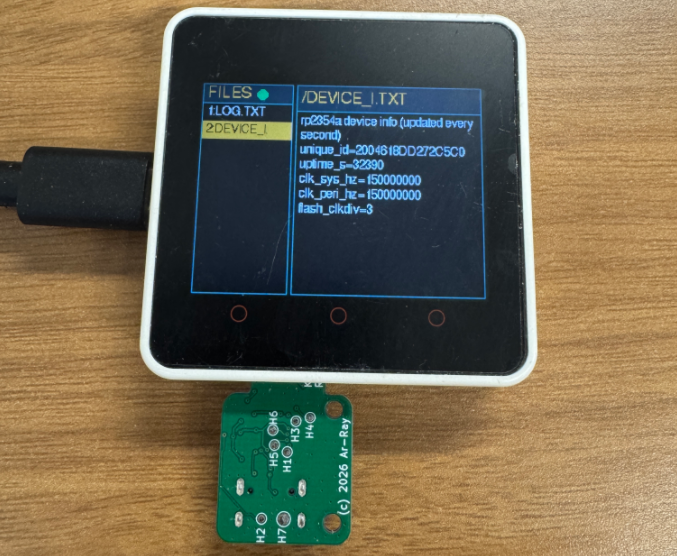

# example/001: Core2 ファイルビューア

M5Stack Core2とKagigataDiskを組み合わせたサンプルです。

- Core2：KagigataDisk上のファイル一覧と中身を画面に表示します。画面下のA/B/Cボタンをタップすると、`/log.txt` に1行追記します。
- KagigataDisk：Core2のファイルをflashに保存し、同じファイルをUSB接続先のPCから見えるようにします。

| ディレクトリ | 中身 |
|---|---|
| [`kagigatadisk/`](kagigatadisk/) | KagigataDisk（RP2354A）のファームウェア（pico-sdk） |
| [`host/`](host/) | M5Stack Core2 のアプリ（PlatformIO）およびホスト側ライブラリ [`host/lib/emu_storage/`](host/lib/emu_storage/README.md) |

準備（ツールと `./tools/install.sh`）はリポジトリの [README](../../README.md) を見てください。

## 書き込み

### 1. KagigataDisk（デバイス側）

```bash
./tools/kagigata_flash.sh --build
```

ビルドしてから、USB経由でUF2ブートローダに切り替えて書き込みます（KagigataDiskのUSB ドライブの `command/update-firmware` を削除すると、ブートローダに切り替わります）。最後に `flashed; drive back as /dev/...` と出れば完了です。

### 2. M5Stack Core2（ホスト側）

```bash
./tools/core2_flash.sh
```

Core2のUSBのポートを自動で探して、ビルドと書き込みを行います。

### 3. 動作確認

KagigataDiskをCore2のカードスロットに挿すと、Core2の画面にファイル一覧が表示され、`FILES` の横の丸が緑になります。画面下のA/B/Cボタンをタップすると、`/log.txt` に1行（`[00:01:23] : [A]` など）追記されます。

とUSBで繋ぐと、KagigataDiskは`RP2350-KagigataDisk`（ボリューム名 `KAGIGATADSK`）というUSBドライブとして見えます。

```
SKILL.md                 使い方（英語、読み取り専用）
command/                 削除すると動作するファイル（ファイルマネージャでゴミ箱に入れても可）
    update-firmware      ブートローダに切り替わる
spi_virtual_device/      Core2から見えているファイル
    README.md            このフォルダの説明（読み取り専用。Core2からも見える）
    log.txt              Core2が書いたログ（PCから書き換え・削除もできる）
    （Core2 が作ったほかのファイル）  同じく書き換え・削除できる
    device_info.txt      KagigataDisk の状態（読み取り専用）
    （その他のファイル）  から置いたファイル。Core2 から読める
```

ドライブの中身（`command/` 以外）は KagigataDiskのflash に保存され、電源を切っても残ります。

flashを傷めないよう、書き込みはRAMに溜めてから次の条件で書き込まれます。
- 最初の書き込みから5秒経ったとき
- 一定のセクタ数が溜まったとき

```bash
cat /run/media/$USER/KAGIGATADSK/spi_virtual_device/log.txt   # "[00:01:23] : [A]" のような行
```

- マイコン側で書き込まれたファイルをPC側で閲覧したい場合はマウントし直します。
- flash（約 1.4 MiB）はPC側とCore2側で共有です。固定の割り当てはなく、先に書いた方が使います。表示される空き容量はマウントした時点の値です。



<br>

## ホスト側ライブラリ（emu_storage）

```cpp
#include <emu_storage.h>

EmuStorage storage;

void setup() {
  if (storage.begin()) {                        // HELLO でプロトコルのバージョンを確認
    storage.appendText("/log.txt", "hello\n");  // 追記（無ければ作る）
    char buf[128];
    size_t n;
    storage.readText("/device_info.txt", buf, sizeof(buf), n);
  }
}
```

KagigataDisk とホストマイコンの間のプロトコルは [`protocol/emu_protocol_defs.h`](protocol/emu_protocol_defs.h) で定義しています。